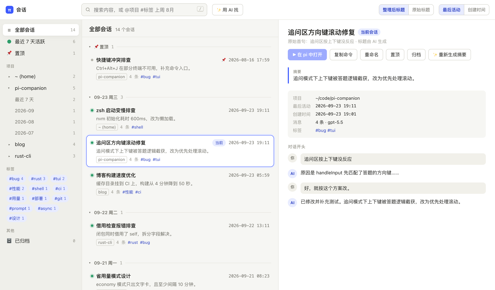

# pi Sessions · 会话管理

在浏览器里按**项目 → 日期**浏览、搜索和整理 pi 的历史会话，点一下就能让正在运行的 pi 切换过去。



## 安装与启动

需要 Node.js 22+ 和 pi 0.85.1 或更新版本。

```bash
# 从 GitHub 安装（写入 ~/.pi/agent/settings.json，所有项目都能用）
pi install git:github.com/woertedetiankong/pi-newsession

# 或锁定到某个版本，不随仓库更新而变化
pi install git:github.com/woertedetiankong/pi-newsession@v0.2.4

# 或只装到当前项目（写入 .pi/settings.json）
pi install git:github.com/woertedetiankong/pi-newsession -l

# 或不安装，只在这次运行中试用
pi -e git:github.com/woertedetiankong/pi-newsession
```

安装后重启 pi，输入 `/sessions`，浏览器会打开会话管理页面。

更新到最新版本：`pi update --extensions`（锁定版本的安装不会被更新，改用 `pi install …@新版本`）。卸载：`pi remove git:github.com/woertedetiankong/pi-newsession`。

| 命令 | 作用 |
| --- | --- |
| `/sessions` | 启动本地页面并在浏览器中打开 |
| `/sessions url` | 显示完整地址（含访问令牌），可复制到其他浏览器 |
| `/sessions stop` | 关闭页面服务（同一网页里的其他插件页面也一并关闭） |

### 和其他 pi 插件共用一个网页

页面由 pi-web 共享服务提供（`src/hub.ts`），同时安装了 [pi-kb 知识库](https://github.com/woertedetiankong/pi-kb) 等支持 pi-web 的插件时，它们在同一个地址下：会话在 `/sessions/`，知识库在 `/kb/`，顶部可以直接切换，共用一个访问令牌。只装了本插件时，页面和以前一样。旧的 `http://127.0.0.1:47291/#token=…` 链接会自动跳到 `/sessions/`。

## 语言 / Language

页面支持中文和英文：点顶部的「EN / 中文」切换，或在地址后加 `?lang=en` / `?lang=zh`；没选过时跟随浏览器语言。切换后，服务端的提示、对话里的系统标注（如「上下文已压缩」）、「用 AI 找」给出的理由、导出图片的文件名（`001-用户.png` / `001-user.png`）也跟着变；换语言后再次导出不会重复写入。

搜索框里的时间词两种语言都能用：`今天 昨天 本周 上周 本月 上个月 8月 2026年8月`，以及 `today yesterday this-week last-week this-month last-month aug august 2026-08`。

终端里 `/sessions` 的提示跟随系统语言（macOS 上读系统界面语言），可以用环境变量 `PI_SESSIONS_LANG=zh|en` 指定。

The page is available in Chinese and English (toggle in the header, or `?lang=en`). Server messages, transcript notes, Ask AI reasons and exported image names follow it. Time words such as `last-week` and `aug` work in the search box in either language. Terminal messages follow the system language or `PI_SESSIONS_LANG`.

## 页面

- **左栏**：全部 / 最近 7 天活跃 / 置顶；项目列表，展开后按「最近 7 天」和月份细分；标签；已归档。
- **中栏**：置顶 → 最近 7 天按日（`09-23 周三`）→ 更早按月（`2026-08`）→ 零碎（1 条消息以内）。每条显示标题、完整日期时间、摘要、项目、消息数和标签。
- **右栏**：摘要、项目、时间、模型、分叉来源，以及**完整对话**；可以打开、重命名、置顶、归档。

### 完整对话

右栏显示会话**当前分支**的全部消息（与在 pi 中恢复该会话时看到的一致），不截断：

- AI 回复按 Markdown 渲染：标题、列表、表格、代码块、链接。
- 工具调用默认折叠为一行（如 `bash npm test`），点开查看参数和输出；失败的调用标红。单个工具输出超过 2 万字时截断。
- 思考过程、上下文压缩、分支摘要折叠显示；勾选对话标题旁的「只看对话」可隐藏思考过程和工具调用，只留提问和回答（设置会被记住）。
- 复制：鼠标移到消息上，右上角「复制全文」复制这条消息的原始 Markdown；代码块、工具参数和输出右上角的「复制」只复制那一块。
- 图片：你发给 AI 的图片、工具读到的图片（如截图）显示为缩略图，点击放大，可「下载图片」保存到本地。图片本来就存在 pi 的会话文件里，页面只是把它读出来，不另外复制。
- 滚动到底部自动加载更多；从搜索进入时自动跳到第一处命中并高亮关键词。
- 正在进行的会话有新消息时不会打断阅读，底部会出现「有新消息，刷新」。
- 「⤢ 专注阅读」隐藏会话列表、加宽对话区，`Esc` 退出。
- 网页中只能查看；要继续对话，点「在 pi 中打开」。

搜索框同时支持：

| 写法 | 含义 |
| --- | --- |
| `缓存 失效` | 全文搜索（所有词都要出现），结果显示命中片段 |
| `@pi` | 限定项目 |
| `#bug` | 限定标签 |
| `今天` `昨天` `本周` `上周` `本月` `上个月` `8月` `2025年12月` `2026-09-21` | 限定时间 |

快捷键：`/` 搜索，`↑` `↓` 选择，`Enter` 或双击在 pi 中打开，`Shift+Enter` 用 AI 找，`Esc` 清空搜索。

## 用 AI 找（语义检索）

记不清用词时，在搜索框里直接描述，例如「上周那个终端滚动的 bug」「讨论怎么给博客加速的那次」，然后点「✨ 用 AI 找」或按 `Shift+Enter`。

插件把描述、今天的日期和最近 600 个会话的摘要行（项目、日期、标题、摘要、标签、首句）发给模型（默认是 **pi 当前选择的模型**），由模型按意思挑出最多 8 个相关会话，并给出理由。**每次搜索是一次模型请求，会产生额外用量**，结果上方会显示本次大约消耗的 token。

按钮右边的下拉框可以换一个模型来找（「AI 整理」也用它）：默认「跟随 pi 当前模型」，也可以选 pi 里任何已配置登录或 API Key 的模型（比如用更便宜、更快的小模型）。选择只保存在这个浏览器里，不会改变 pi 本身正在用的模型。

- 能理解同义词、中英文和概括说法，也会把描述里的时间、项目当作线索。
- 模型只看到摘要行，看不到完整对话；先运行「AI 整理」生成摘要，结果会准确很多。
- 模型只能从候选编号中选择，编造或重复的编号会被丢弃。
- 继续编辑搜索框、点左栏或按 `Esc` 会回到普通搜索。

## 打开会话

「在 pi 中打开」会让当前运行的 pi 切换到该会话。pi 正在执行任务时不会切换，页面会提示稍后再试。

切换后，插件会把运行这个 pi 的终端自动调回最前面，不用再手动点回终端：

| 终端 | 效果 |
| --- | --- |
| macOS · iTerm2、系统「终端」 | 精确跳到 pi 所在的窗口和标签页（也支持 tmux 中的面板） |
| macOS · Ghostty、Warp、WezTerm、kitty、VS Code、Cursor 等 | 把该应用调到前台 |
| Windows（实验性，未经测试） | 把 pi 所在的窗口调到前台；Windows Terminal 中无法定位到具体标签页；被系统拦截时任务栏图标会闪烁 |
| Linux | 暂不支持 |

macOS 第一次使用时，系统可能询问是否允许终端「控制」自己（自动化权限），允许后才能精确定位标签页；拒绝时退回到只激活应用。不想要这个行为，启动 pi 前设置 `PI_SESSIONS_FOCUS=0`。

## AI 整理

点击顶部「✨ AI 整理」，插件用顶部下拉框所选的模型（默认是 **pi 当前选择的模型**）为还没整理过的会话（2 条消息以上）生成标题、摘要和 1～3 个标签；也可以在右栏对单个会话生成。**每个会话一次独立模型请求，会产生额外用量**，开始前会确认，过程中可以取消。

手动重命名的标题不会被 AI 覆盖。手动重命名还会写回会话文件，pi 自带的 `/resume` 里也能看到。AI 标题、摘要、标签、置顶和归档只保存在插件自己的文件里，不修改会话文件。

## 在远程服务器上使用

pi 跑在 SSH 远程机器上时，页面服务只监听那台机器的 `127.0.0.1`，本地浏览器无法直接访问。用端口转发把它带到本地：

```bash
ssh -L 47291:127.0.0.1:47291 你的服务器
```

然后在远程的 pi 中运行 `/sessions url`，把显示的完整地址（含 `#token=…`）粘贴到本地浏览器。端口 47291 被占用时插件会换用随机端口，以 `/sessions url` 显示的为准。

## 存储位置

点左栏底部的「📁 存储位置」，可以看到数据都存在哪里，每个目录都能一键在访达 / 资源管理器中打开。涉及两份数据，分开设置：

| 数据 | 谁负责 | 默认位置 | 怎么换 |
|---|---|---|---|
| 对话本身（会话文件 `.jsonl`） | pi | `~/.pi/agent/sessions/` | 用 pi 自己的设置，见下 |
| 插件整理出的标题、摘要、标签、置顶、归档（`meta.json`） | 本插件 | `~/.pi/agent/pi-sessions/` | 直接在「存储位置」里改 |

**换对话的存储位置**（比如系统盘快满了，或者想让对话跟着项目走）：在 pi 的 `~/.pi/agent/settings.json` 里设置（「存储位置」里可以一键复制）

```json
{ "sessionDir": "~/Documents/pi-sessions" }
```

保存后重启 pi 生效。也可以用启动参数 `pi --session-dir <目录>` 或环境变量 `PI_CODING_AGENT_SESSION_DIR`（优先级：启动参数 > 环境变量 > settings）。写相对路径（如 `".pi/sessions"`）时，路径相对于启动 pi 时所在的目录，在项目里启动 pi 时，对话就存进该项目的文件夹。插件会在 pi 使用新目录时自动记住它并一起列出。已有的旧对话不会自动搬过去，需要的话手动移动文件夹里的内容。插件不会替你修改 pi 的设置。

**换插件数据的位置**：在「存储位置」的输入框里填新目录（例如 `~/Dropbox/pi-sessions`），点「移到这里」。

- 立即生效，不用重启 pi，其他打开着的 pi 窗口也会跟着切换。
- 现有数据会合并到新位置：新位置已有的数据（比如从另一台电脑同步来的）会保留，同一个会话两边都有时以你正在用的这份为准。
- 原位置的 `meta.json` 会留着，确认没问题后可以自己删掉。随时可以点「恢复默认位置」切回来，同样会合并。
- AI 整理进行中时不能移动，完成或取消后再试。
- 这个设置保存在本机的 `~/.pi/agent/pi-sessions/config.json`。访问令牌保存在本机的 `~/.pi/agent/pi-web/token`，不会进入同步文件夹。

也可以用环境变量 `PI_SESSIONS_DATA_DIR` 指定（优先于页面上的设置，设置后页面上不能再改）。第一次使用时，插件会把默认位置的 `meta.json` 复制过去，新位置已有 `meta.json` 时不会覆盖。

**导出图片到文件夹**：会话里的图片本来存在会话文件内。想要单独的图片文件时：

- 在「存储位置」的「导出图片」里填一个文件夹，点「设为导出位置」。默认是 `~/Pictures/pi-sessions`，设置保存在 `~/.pi/agent/pi-sessions/config.json`。
- 在会话详情点「🖼 导出图片（N）」导出这一个会话，或者在「存储位置」里点「导出全部会话的图片」。导出完成后会自动打开文件夹。
- 每个会话一个子文件夹，名字是 `日期_标题_会话id前8位`，图片按出现顺序命名，例如 `001-用户.png`、`002-工具.png`。包括所有分支上的图片。
- 再次导出只会补上新图片；会话改名后仍写进原来的文件夹。已有文件不会被删除或修改，会话文件里的原图也不受影响。

**在多台电脑之间同步或备份**：把对话目录（`sessionDir`）和插件数据都放进同一个同步文件夹（iCloud、Dropbox、OneDrive 等），这样对话和整理结果会一起过去。避免两台电脑同时打开同一个会话，以免同步冲突。

## 数据与安全

- **隐私**：浏览、关键词搜索、置顶、归档、重命名都只在本机进行。只有你主动点击「AI 整理」或「用 AI 找」时，才会把内容发给顶部下拉框所选模型的服务商（默认是 **pi 当前所用模型的服务商**）：AI 整理发送每个会话的项目路径和前几条消息（最多约 6000 字），用 AI 找发送你的描述以及最近 600 个会话的项目名、日期、标题、摘要、标签和首句。服务商如何处理这些数据，以其隐私政策为准，与你平时和 pi 对话相同。

- 会话从 `~/.pi/agent/sessions/`（或 `PI_CODING_AGENT_DIR` 指定的目录）读取，按文件修改时间增量缓存。
- 通过 `--session-dir`、`PI_CODING_AGENT_SESSION_DIR` 或 settings 中的 `sessionDir` 自定义了会话目录时，插件会在 pi 使用该目录时自动记住它，之后一并列出。
- 同时打开多个 pi 窗口时可以放心操作：每次保存都会加锁并基于最新文件合并，不会互相覆盖。
- 插件数据保存在 `~/.pi/agent/pi-sessions/`：`meta.json`（标题、摘要、标签、置顶、归档、自定义会话目录；可以换位置，见「存储位置」）。页面访问令牌在 `~/.pi/agent/pi-web/token`（权限 0600，始终留在本机，和其他 pi-web 插件共用；升级时沿用原来 `pi-sessions/token` 里的令牌，旧链接继续有效）。
- 页面服务只监听 `127.0.0.1`，优先使用端口 47291；所有接口都要求访问令牌，并拒绝非本机 Host 的请求。令牌放在地址的 `#` 之后，不会出现在请求日志里。
- 服务在 pi 退出或 `/reload` 时关闭（共用网页的所有插件都退出后才关闭），会话切换时保持运行。

## 平台

在 macOS 上开发和测试。Linux 应当可用（打开浏览器依赖 `xdg-open`，没有时用 `/sessions url` 手动打开）。**尚未在 Windows 上测试**，遇到问题欢迎提 issue。

## 开发

```bash
git clone https://github.com/woertedetiankong/pi-newsession.git
cd pi-newsession
npm ci
pi -e ./index.ts   # 加载本地源码；改动后重启 pi 生效
npm run check   # 类型检查
npm test        # 单元与集成测试
```
